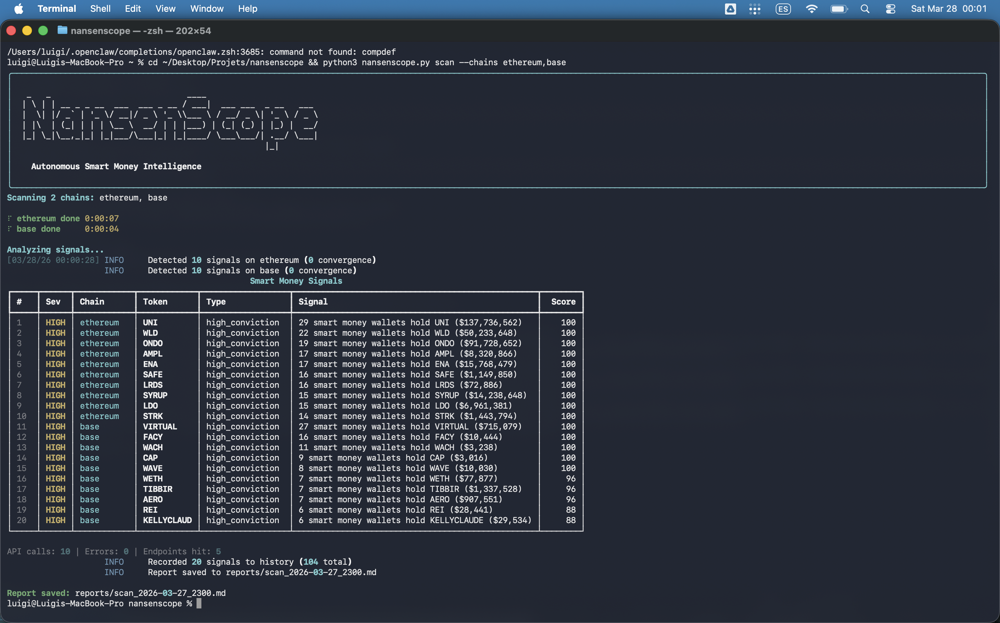
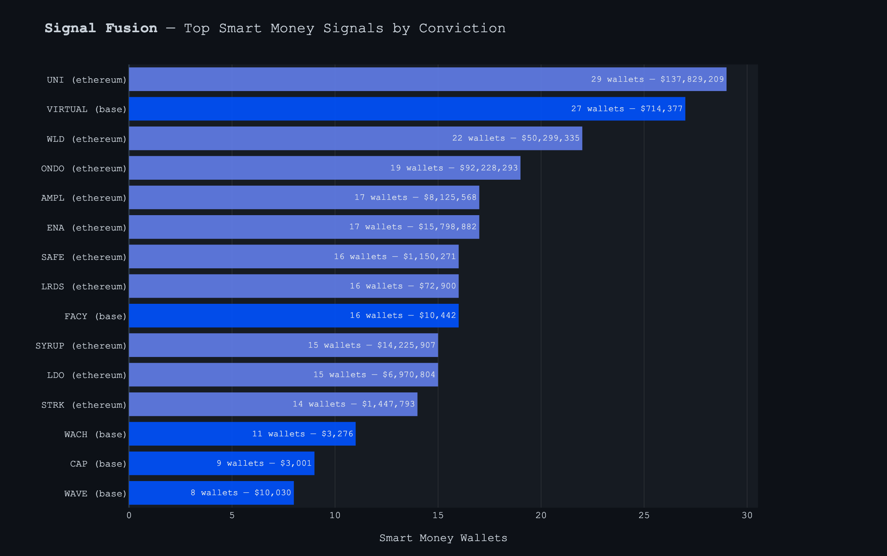
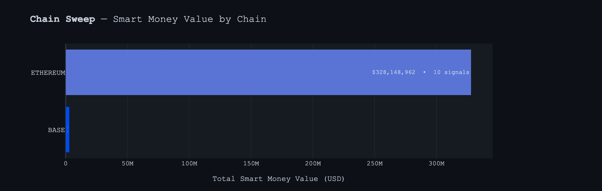

# NansenScope 🔬

**Autonomous Smart Money Intelligence Agent**

> Track what smart money does — before the market moves.

[]()
[]()
[]()
[]()
[](https://github.com/Luigi08001/nansenscope/actions)
[]()
[]()

[Live Demo](https://luigi08001.github.io/nansenscope/) · [Architecture](#architecture) · [Quick Start](#quick-start) · [Example Reports](examples/)

---

<video src="https://github.com/Luigi08001/nansenscope/raw/main/docs/demo_web.mp4" width="100%" autoplay muted loop></video>

---

## What is NansenScope?

NansenScope is a CLI-powered intelligence platform that turns Nansen's raw blockchain data into actionable signals. It scans 18 chains, detects wallet clusters, tracks leveraged bets on Hyperliquid, identifies cross-chain convergence patterns, and alerts you — all autonomously.

**One command. Full intelligence pipeline.**

```bash
$ nansenscope daily --chains ethereum,base,solana,arbitrum,bnb
```

## Why NansenScope?

| Problem | NansenScope Solution |
|---|---|
| Smart money data is scattered across chains | **Chain Sweep** — parallel scanning across 18 blockchains |
| Hard to know if wallets are related | **Syndicate Hunter** — BFS graph traversal maps wallet clusters |
| Miss leveraged positions on Hyperliquid | **Leverage Radar** — real-time SM perp tracking |
| Same token moving on multiple chains | **Signal Fusion** — cross-chain convergence detection |
| Too much noise, missed alerts | **Threat Matrix** — 5 alert rules with cooldown engine |
| Manual daily research takes hours | **Morning Brief** — one command, full pipeline |

## Features

### 18 Commands

| Command | What it does |
|---|---|
| `scan` | Multi-chain smart money scanning. 18 chains, parallel async |
| `profile` | Wallet deep dive (labels, holdings, behavior) |
| `signals` | Detect + rank signals from scan output |
| `report` | Generate full intelligence report from scan data |
| `alerts` | Rule-based alerting with cooldown + history |
| `charts` | Plotly visualizations (timeline, heatmap, ranking views) |
| `network` | Wallet graph analysis via BFS (clusters + centrality) |
| `perps` | Hyperliquid perp intelligence (L/S ratio + consensus) |
| `watch` | Continuous monitoring loop, alerts only on NEW signals |
| `portfolio` | Portfolio breakdown (holdings, labels, PnL) |
| `quote` | DEX quote lookup via Nansen |
| `daily` | Full pipeline: scan → signals → alerts → charts → report |
| `analyze` | Nansen AI narrative synthesis from scan context |
| `exit-signals` | Detect possible smart money distribution/dumps |
| `defi` | DeFi positions analysis for a wallet |
| `search` | Search tokens/entities across Nansen datasets |
| `history` | Signal history persistence + trend analysis |
| `prediction` | Prediction-market intelligence (Polymarket) |
| `--version` | Print CLI version |

### Signal Detection Engine

5 signal detectors running in parallel:
1. **High Conviction Holding** — multiple SM wallets holding same token
2. **Netflow Surge** — unusual token netflow (>$1M threshold)
3. **DEX Trade Whale** — large DEX trades from labeled wallets
4. **Token Screener** — tokens attracting new SM attention
5. **Cross-Chain Convergence** — same token flagged on multiple chains = highest conviction

### Architecture

```
nansenscope.py          CLI entry point (argparse + Rich)
  ├── scanner.py        Nansen CLI wrappers (async, retry, backoff)
  ├── signals.py        Signal detection (5 detectors + convergence)
  ├── alerts.py         Alert engine (5 rules, cooldowns, history)
  ├── charts.py         Plotly visualizations (dark theme)
  ├── reporter.py       Markdown report generator
  ├── network.py        Wallet graph analysis (BFS, clusters)
  ├── perps.py          Hyperliquid perp intelligence
  └── config.py         Chains, thresholds, API tracking

skill/                  OpenClaw Agent Skill
  ├── SKILL.md          Skill manifest & documentation
  └── scripts/
      ├── daily_scan.py     Cron-ready daily pipeline
      ├── watch_scan.py     Single-cycle scanner with state dedup
      └── portfolio_check.py  Wallet change detection
```

### Stats

- **7,300+ lines of Python** (+ tests)
- **18 chains** supported (ethereum, solana, base, arbitrum, bnb, polygon, optimism, avalanche, linea, scroll, mantle, ronin, sei, plasma, sonic, monad, hyperevm, iotaevm)
- **18 CLI commands**
- **5 signal detectors** + convergence engine
- **5 alert rules** with persistent cooldowns
- **10 unit tests** (config + signal engine)
- **x402 micropayment** — no API key needed, pay per call with USDC on Base

## Quick Start

```bash
# 1. Install Nansen CLI
npm install -g nansen-cli

# 2. Create & fund x402 wallet (USDC on Base)
nansen wallet create

# 3. Clone NansenScope
git clone https://github.com/Luigi08001/nansenscope
cd nansenscope

# 4. Install Python dependencies
pip install -r requirements.txt

# 5. Run daily intelligence pipeline
python nansenscope.py daily --chains ethereum,base,solana

# 6. Start continuous monitoring
python nansenscope.py watch --chains ethereum,base,solana --interval 5
```

## Troubleshooting

### "Payment required" warnings
If you see warnings like `Payment required for smart-money/...` during `scan`:

1. Confirm wallet exists: `nansen wallet list`
2. Fund wallet with **USDC on Base**
3. Retry with a single chain first: `python nansenscope.py scan --chains ethereum`

NansenScope will continue gracefully and still produce a report, but signal quality drops when paid endpoints are unavailable.

## Example Output

### Scan (real data — March 27, 2026)
```
$ nansenscope scan --chains ethereum,base

Scanning 2 chains: ethereum, base
✓ ethereum done (8s)
✓ base done (4s)

                    Smart Money Signals
 #   Sev   Chain      Token    Type              Signal
 1   HIGH  ethereum   UNI      high_conviction   29 SM wallets ($137.8M)
 2   HIGH  ethereum   WLD      high_conviction   22 SM wallets ($50.3M)
 3   HIGH  ethereum   ONDO     high_conviction   19 SM wallets ($91.7M)
 4   HIGH  ethereum   AMPL     high_conviction   17 SM wallets ($8.1M)
 5   HIGH  ethereum   ENA      high_conviction   17 SM wallets ($15.8M)
 6   HIGH  base       VIRTUAL  high_conviction   27 SM wallets ($715K)
 7   HIGH  base       AERO     high_conviction   7 SM wallets ($907K)

API calls: 10 | Errors: 0 | Endpoints hit: 5
```

> See [examples/](examples/) for full reports and charts from live scans.

### Watch Mode (continuous monitoring)
```
$ nansenscope watch --chains ethereum,base --interval 5

━━━ Cycle 1 — 14:23:05 UTC ━━━
Scanned 2 chains | 15 total signals | 15 NEW

━━━ Cycle 2 — 14:28:07 UTC ━━━
Scanned 2 chains | 16 total signals | 1 NEW
  NEW: HIGH | base | VIRTUAL | high_conviction | 28 top traders ($812K)
```

### Network Analysis
```
$ nansenscope network --address <wallet> --chain ethereum --hops 2

Network: 12 nodes, 11 edges
Wallet Clusters: 2 detected

  Cluster #1: 8 wallets | $2.1M total PnL
  Cluster #0: 4 wallets | $450K total PnL
```

### Perps Intelligence
```
$ nansenscope perps

Positions: 50 | Volume: $208,111 | Traders: 5
L/S Ratio: 18.91 (strongly bullish)
```

## Verifiability

Every API call is paid via **x402 micropayments** (USDC on Base), creating an on-chain audit trail:

- **Wallet**: [`0x695CD56C13b088F26A99027A89d7aa8A242084F6`](https://basescan.org/address/0x695CD56C13b088F26A99027A89d7aa8A242084F6)
- **Each API call** = a USDC microtransaction on Base
- **Anyone** can verify call count via Basescan token transfers
- **Signal data** comes directly from Nansen's labeled smart money datasets — run the same scan, get the same results
- **Reports are reproducible** — `nansenscope daily` generates the same report structure from live data

```
# Verify API usage on-chain
https://basescan.org/address/0x695CD56C13b088F26A99027A89d7aa8A242084F6#tokentxns
```

## OpenClaw Integration

NansenScope ships as an OpenClaw Agent Skill for autonomous operation:

```bash
# Daily scan at 8:00 AM UTC
python3 skill/scripts/daily_scan.py --chains ethereum,base,solana --webhook <url>

# Watch mode — single cycle for cron
python3 skill/scripts/watch_scan.py --chains ethereum,base

# Portfolio monitoring
python3 skill/scripts/portfolio_check.py --threshold 10
```

## Configuration

Key thresholds in `config.py`:

| Parameter | Default | Description |
|---|---|---|
| `netflow_significant_usd` | $1M | Minimum netflow to flag |
| `screener_min_smart_holders` | 3 | Min SM holders to flag |
| `convergence_min_signals` | 2 | Min signals for convergence |
| `accumulation_ratio` | 2.0 | Buy/sell ratio threshold |

## Built With

- [Nansen CLI](https://agents.nansen.ai/) — onchain intelligence API
- [x402](https://www.x402.org/) — micropayment protocol (USDC on Base)
- [Rich](https://rich.readthedocs.io/) — terminal UI
- [Plotly](https://plotly.com/) — data visualization
- [OpenClaw](https://openclaw.ai/) — AI agent orchestration

## License

MIT

---

## Screenshots

| Terminal Scan | Signal Fusion | Chain Sweep |
|---|---|---|
|  |  |  |

---

**Built for [#NansenCLI Challenge](https://agents.nansen.ai/) Week 2** by [@luigi08002](https://x.com/luigi08002)
